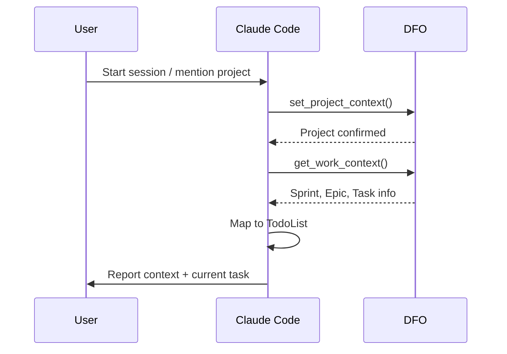
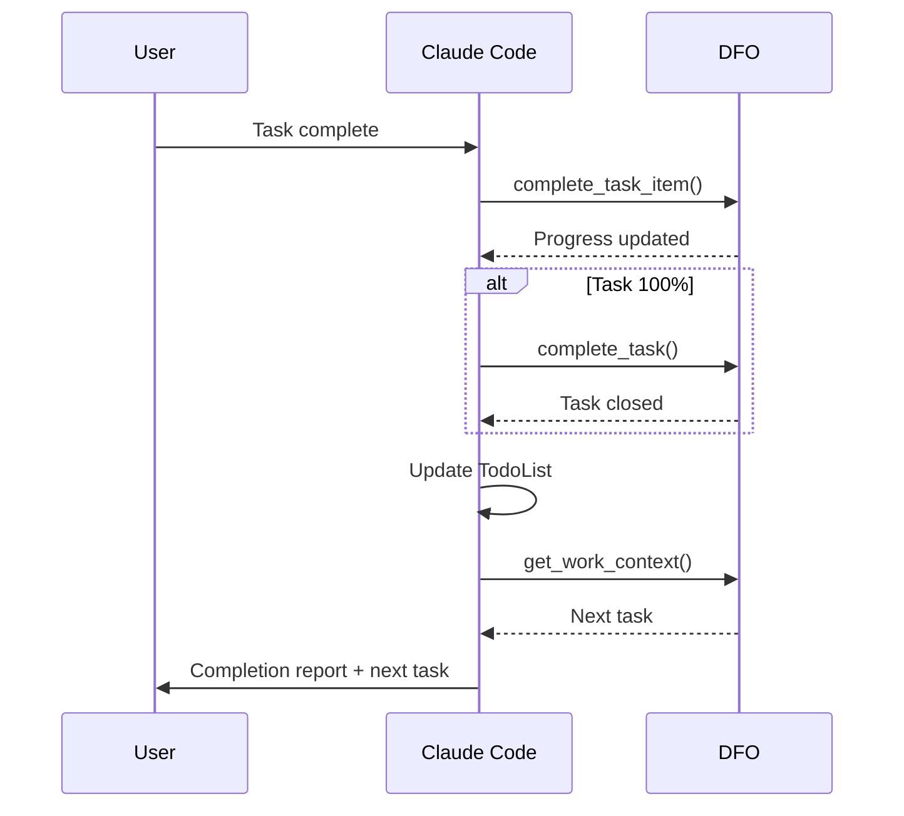
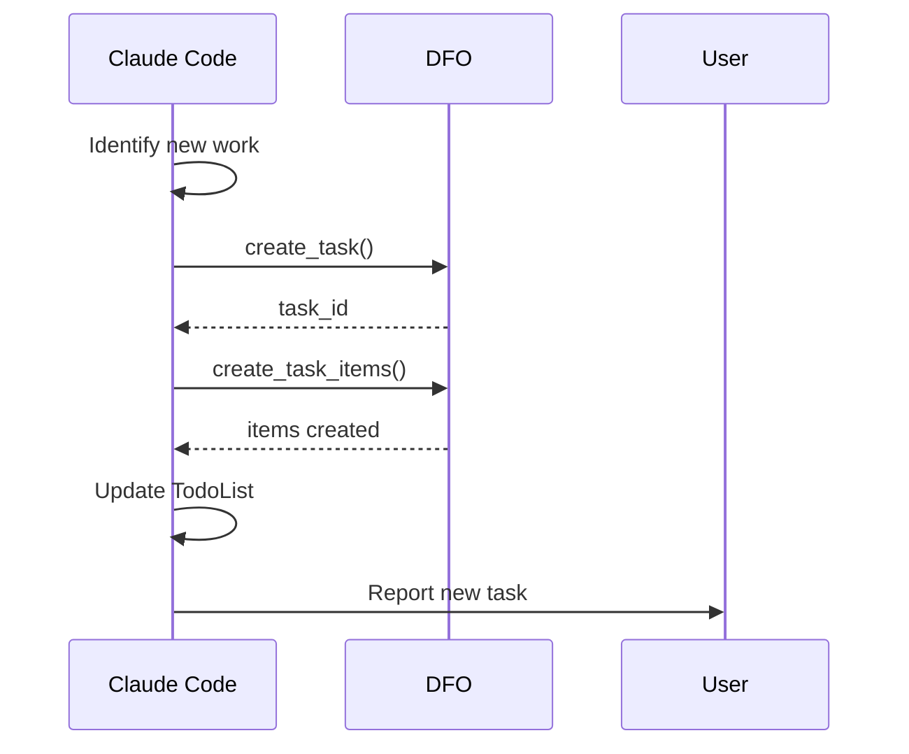

# DFO Workflow Protocols

Standard operating procedures for synchronization between Claude Code and SOLARIA DFO.

## Protocol 1: Session Initialization

### Trigger
- User starts a new development session
- User mentions a project name
- User invokes `/dfo` or `/dfo sync`

### Sequence



### Implementation

```
1. Identify project from:
   - Explicit user mention ("work on Akademate")
   - Working directory analysis
   - Last session memory

2. Set context:
   set_project_context(project_name: "Akademate.com")

3. Get full work context:
   context = get_work_context()

4. Extract actionable items:
   current_task = context.current_task
   pending_items = current_task.items.filter(not completed)

5. Build TodoList:
   todos = [
     {content: current_task.title, status: "in_progress"},
     ...pending_items.map(item => {content: item.title, status: "pending"})
   ]

6. Report to user (executive format):
   DFO Status: Akademate.com
   ━━━━━━━━━━━━━━━━━━━━━━
   Sprint: Development Phase | Active
   Epic: User Authentication

   Current Task: Implement JWT authentication
   Progress: [██████░░░░] 60%
```

---

## Protocol 2: Task Completion

### Trigger
- User confirms task/subtask is done
- Code implementation verified working
- Tests passing

### Sequence



### Implementation

```
1. Identify completed work:
   - Match TodoList item to DFO task/item
   - task_id, item_id from context

2. Complete subtask:
   complete_task_item(
     task_id: 123,
     item_id: 456,
     actual_minutes: 45,
     notes: "Implemented JWT with refresh token rotation"
   )

3. Check parent task:
   task = get_task(task_id: 123)
   if task.progress == 100:
     complete_task(
       task_id: 123,
       completion_notes: "Full authentication system implemented and tested"
     )

4. Update TodoList:
   Mark completed item
   Remove from active list

5. Get next work:
   context = get_work_context()
   Add next task to TodoList

6. Report:
   Status: Task Completed
   ━━━━━━━━━━━━━━━━━━━━━
   Completed: Implement JWT authentication
   Duration: 45 min

   Next: Create course enrollment API
   Priority: High
```

---

## Protocol 3: New Work Discovery

### Trigger
- Bug found during development
- New requirement identified
- Technical debt discovered
- Improvement opportunity

### Sequence



### Implementation

```
1. Classify work type:
   - bug: Priority based on severity
   - feature: Priority based on business value
   - tech_debt: Priority = medium (unless blocking)

2. Create task:
   new_task = create_task(
     title: "Fix race condition in enrollment",
     description: "Found during auth testing. Concurrent enrollments can corrupt data.",
     priority: "high",
     project_id: current_project.id,
     assigned_agent_id: 11,  // Claude Code
     estimated_hours: 2
   )

3. Break into subtasks:
   create_task_items(
     task_id: new_task.id,
     items: [
       {title: "Identify race condition source", estimated_minutes: 30},
       {title: "Implement mutex lock", estimated_minutes: 45},
       {title: "Add concurrency tests", estimated_minutes: 45}
     ]
   )

4. Log to memory (if significant):
   memory_create(
     content: "Race condition found in enrollment service...",
     tags: ["bug", "learning", "concurrency"],
     importance: 0.7
   )

5. Update TodoList based on priority:
   If high/critical: Add to current todos
   If medium/low: Note for later

6. Report:
   New Task Created: #task_id
   ━━━━━━━━━━━━━━━━━━━━━
   Title: Fix race condition in enrollment
   Priority: High
   Estimated: 2h

   Subtasks:
   1. Identify race condition source (30m)
   2. Implement mutex lock (45m)
   3. Add concurrency tests (45m)
```

---

## Protocol 4: Progress Checkpoint

### Trigger
- Every 30 minutes of active work
- Before significant context switch
- User asks for status

### Sequence

```
1. Sync current TodoList state to DFO:
   - Update task progress
   - Complete any finished items

2. Refresh context:
   context = get_work_context()

3. Validate alignment:
   - TodoList matches DFO state
   - No stale items

4. Report brief status
```

### Implementation

```
1. For each in_progress todo:
   - Check if actual work done
   - Update corresponding DFO item if changed

2. Refresh:
   context = get_work_context()

3. Reconcile:
   If DFO has items not in TodoList: Add them
   If TodoList has items not in DFO: Create them or remove

4. Brief report (only if changes):
   Progress Checkpoint
   ━━━━━━━━━━━━━━━━━━
   Current: Implementing feature X
   Progress: 4/7 items complete
   Time: ~2h remaining
```

---

## Protocol 5: Blocker Handling

### Trigger
- Cannot proceed with task
- Waiting for external input
- Dependency not met

### Sequence

```
1. Mark task as blocked in DFO:
   update_task(
     task_id: 123,
     status: "blocked"
   )

2. Create memory of blocker:
   memory_create(
     content: "Blocked on X because Y",
     tags: ["blocker", "context"],
     importance: 0.8
   )

3. Identify alternative work:
   - Get other pending tasks
   - Prioritize unblocked work

4. Update TodoList:
   - Move blocked item to pending (flagged)
   - Add alternative work

5. Report with resolution path
```

### Report Format

```
Blocker Detected
━━━━━━━━━━━━━━━
Task: Integrate payment gateway
Reason: Stripe API keys not configured
Required: Admin to add keys to .env

Alternative Work Available:
1. User profile UI - High
2. Email templates - Medium

Switching to: User profile UI
```

---

## Protocol 6: Session End

### Trigger
- User ends session
- Extended inactivity
- Explicit `/dfo save`

### Sequence

```
1. Final sync to DFO:
   - All progress updates
   - Any pending completions

2. Create session memory:
   memory_create(
     content: "Session summary: Completed X, Y. In progress: Z.",
     tags: ["session", "context"],
     summary: "Dec 26 session - Auth implementation",
     importance: 0.6
   )

3. Report final state

4. Suggest next session priorities
```

### Report Format

```
Session Saved to DFO
━━━━━━━━━━━━━━━━━━━
Project: Akademate.com
Duration: 3h 45m

Completed:
- JWT authentication (100%)
- Refresh token rotation (100%)

In Progress:
- Course enrollment API (40%)

Tomorrow's Priority:
1. Complete enrollment API
2. Start admin dashboard
```

---

## Error Recovery Protocols

### DFO Connection Failure

```
1. Retry with exponential backoff (1s, 2s, 4s)
2. If persistent:
   - Continue local work
   - Queue updates for later sync
   - Warn user about offline mode
3. On reconnect:
   - Batch sync all queued updates
```

### Task ID Mismatch

```
1. Refresh context: get_work_context()
2. Re-map TodoList to current DFO state
3. Warn user if significant changes detected
```

### Concurrent Modification

```
1. Get latest from DFO
2. Compare with local state
3. If conflict:
   - DFO wins for status/progress
   - Preserve local notes/context
4. Report reconciliation
```

---

## TodoList Size Management

### Rules

- Maximum 7 items visible
- Priority order: in_progress > high > medium > low
- Completed items removed immediately
- Blocked items move to bottom

### Overflow Handling

```
If pending_tasks > 7:
  visible = [
    current_in_progress,
    top_4_by_priority,
    "... and N more tasks in DFO"
  ]
```

---

## Memory Tag Guidelines

| Tag | Use For |
|-----|---------|
| `decision` | Architecture choices, tech decisions |
| `learning` | New knowledge gained during work |
| `context` | Project/task context for continuity |
| `bug` | Bug reports and fixes |
| `pattern` | Code patterns, best practices |
| `solution` | Solutions to problems |
| `config` | Configuration information |
| `requirement` | User/system requirements |
| `todo` | Future tasks to remember |
| `feedback` | User/stakeholder feedback |
| `meeting` | Meeting notes |
| `credential` | Access info (use carefully) |
